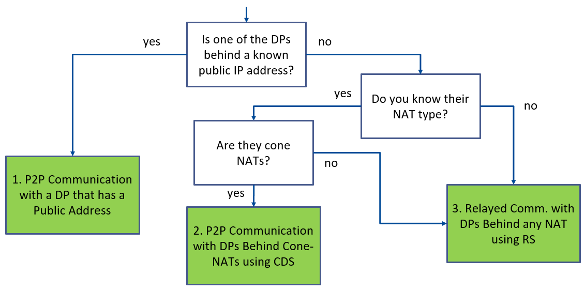

# RTI Connext Professional WAN Demo

This repository contains 3 demos of RTI Connext Professional WAN 7.3.0 using
Shapes Demo, and Routing Service, Cloud Discovery Service. This repository is
split in 2: _non-security_ scenarios and _security_ scenarios.

> **Note:** The `main` branch uses **RTI Connext 7.3.0**. If you're looking
for the version compatible with **RTI Connext 6.1.2**, please switch to the
[`release/6.1.2`](https://github.com/rticommunity/rticonnext-wan-demo/tree/release/6.1.2) branch.

The publisher and subscriber you will use for all the demos is Shapes Demo. All
the scenarios require Routing Service to interface between Shapes Demo on your
LAN and the WAN.

These are the RTI packages you will need:

```plaintext
rti_connext_dds-7.3.0-pro-host-<architecture>.<run/exe>
rti_real_time_wan_transport-7.3.0-host-<architecture>.rtipkg
rti_cloud_discovery_service-7.3.0-host-<architecture>.rtipkg
rti_security_plugins-7.3.0-host-openssl-3.0-<architecture>.rtipkg (if using Security)
openssl-3.0.12-7.3.0-host-<architecture>.rtipkg (if using Security)
```

As an example, if you were using Linux 64, you would need these packages:

```plaintext
rti_connext_dds-7.3.0-pro-host-x64Linux.run
rti_real_time_wan_transport-7.3.0-host-x64Linux.rtipkg
rti_cloud_discovery_service-7.3.0-host-x64Linux.rtipkg
rti_security_plugins-7.3.0-host-openssl-3.0-x64Linux.rtipkg
openssl-3.0.12-7.3.0-host-x64Linux.rtipkg
```

This is the structure of the repository:

* Non-security scenarios
  * [Scenario 1](non_security_scenarios/scenario_1): Peer-to-peer communication with a DomainParticipant that has a public IP address.
  * [Scenario 2](non_security_scenarios/scenario_2): Peer-to-peer communication with DomainParticipants behind cone NATs using [Cloud Discovery Service](https://community.rti.com/static/documentation/connext-dds/7.3.0/doc/manuals/addon_products/cloud_discovery_service/index.html).
  * [Scenario 3](non_security_scenarios/scenario_3): Relayed communication with DomainParticipants behind any NAT using [Routing Service](https://community.rti.com/static/documentation/connext-dds/7.3.0/doc/manuals/connext_dds_professional/services/routing_service/index.html).
* Security scenarios
  * [Scenario 1](security_scenarios/scenario_1): Peer-to-peer communication with a DomainParticipant that has a public IP address, securing the WAN domain.
  * [Scenario 2](security_scenarios/scenario_2): Peer-to-peer communication with DomainParticipants behind cone NATs using [Cloud Discovery Service](https://community.rti.com/static/documentation/connext-dds/7.3.0/doc/manuals/addon_products/cloud_discovery_service/index.html), securing the WAN domain.
  * [Scenario 3](security_scenarios/scenario_3): Relayed communication with DomainParticipants behind any NAT using [Routing Service](https://community.rti.com/static/documentation/connext-dds/7.3.0/doc/manuals/connext_dds_professional/services/routing_service/index.html), securing the WAN domain.

You can use this decision tree to decide what scenario suits your needs:



You can use the NAT type checker script in [resources/nat_type_checker](./resources/nat_type_checker)
if you need to use scenario 2, which requires cone NATs.
