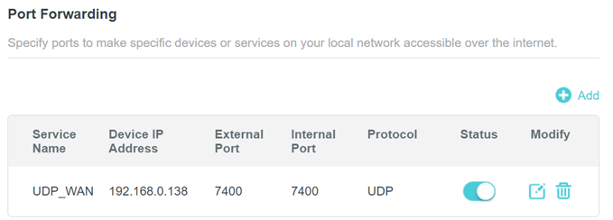
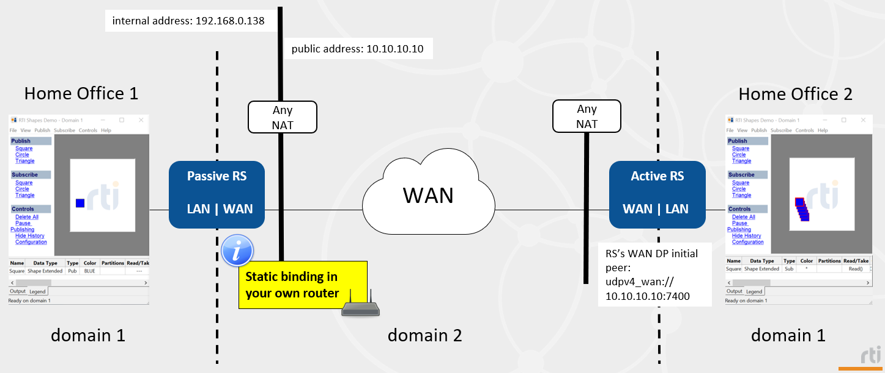

# Non-security scenario 1

## Requirements

Packages:
```
rti_connext_dds-6.1.0-pro-host-<architecture>.<run/exe>
rti_real_time_wan_transport-6.1.0-host-<architecture>.rtipkg
```

Network configuration:
* Static mapping of your home office's router between a PUBLIC_PORT and an INTERNAL_PORT, for the UDP protocol. For instance:



## Diagram



The passive Routing Service will listen for incoming communications. The active Routing Service will use its initial peers to start the communication with the passive one. In the diagram above, the public address needs to be known by the remote active Routing Services.

## How to run this scenario

1. On Home Office 1:
    1. Start a Shapes Demo publisher on domain 1. Publish some shapes.
    2. In a terminal, set up NDDSHOME pointing at the Connext installation and set these variables:
    ```
    export PUBLIC_ADDRESS=<public_IP_address>
    export PUBLIC_PORT=<PUBLIC_PORT>
    export INTERNAL_PORT=<INTERNAL_PORT>
    ```
    3. Run Routing Service:
    ```
    cd non_security_scenarios/scenario_1/
    $NDDSHOME/bin/rtiroutingservice -cfgFile RsConfig_passive.xml -cfgName RsConfig_passive
    ```
2. On Home Office 2:
    1. Start a Shapes Demo subscriber on domain 1. Subscribe to some shapes.
    2. In a terminal, set up NDDSHOME pointing at the Connext installation and set these variables:
    ```
    export PUBLIC_ADDRESS=<public_IP_address>
    export PUBLIC_PORT=<PUBLIC_PORT>
    ```
    3. Run Routing Service:
    ```
    cd non_security_scenarios/scenario_1/
    $NDDSHOME/bin/rtiroutingservice -cfgFile RsConfig_active.xml -cfgName RsConfig_active
    ```

# Expected output

After some seconds, once discovery is completed, Home Office 2 should start receiving the shapes that Home Office 1 publishes. Actually, you could start any number of Shapes Demo publishers on either side and the other one should receive those, as well. Routing Service helps scaling.