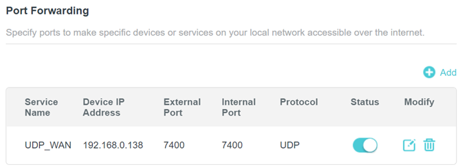
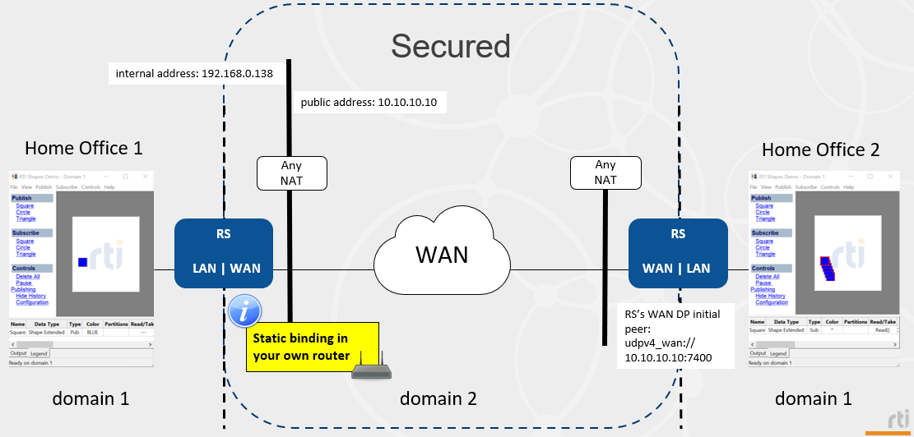

# Security scenario 1: Peer-to-peer communication with a DomainParticipant that has a public IP address, securing the WAN domain

## Requirements

Packages:

```plaintext
rti_connext_dds-7.3.0-pro-host-<architecture>.<run/exe>
rti_real_time_wan_transport-7.3.0-host-<architecture>.rtipkg
rti_security_plugins-7.3.0-host-openssl-3.0-<architecture>.rtipkg
openssl-3.0.12-7.3.0-host-<architecture>.rtipkg
```

With regards to network configuration, you'll need to set up a static mapping
of your home office's router between a `PUBLIC_PORT` and an `INTERNAL_PORT`, for
the UDP protocol. For instance:



## Diagram



The passive Routing Service will listen for incoming communications. The Active
Routing Service will use its initial peers to start the communication with the
Passive one. In the diagram above, the public address needs to be known by the
remote Active Routing Service. Only **domain 2** (WAN) will be secured.

## How to run this scenario

On Home Office 1:

1. Start a Shapes Demo publisher on **domain 1**. Publish some shapes.
2. In a terminal, set up `NDDSHOME` pointing at the Connext installation and set these variables:

    ```bash
    export PUBLIC_ADDRESS=<public_IP_address>
    export PUBLIC_PORT=<PUBLIC_PORT>
    export INTERNAL_PORT=<INTERNAL_PORT>
    ```

3. Run Routing Service:

    ```bash
    cd security_scenarios/scenario_1/
    $NDDSHOME/bin/rtiroutingservice -cfgFile "../../Qos.xml;RsConfig_Passive.xml" -cfgName RsConfig_Passive
    ```

On Home Office 2:

1. Start a Shapes Demo subscriber on **domain 1**. Subscribe to some shapes.
2. In a terminal, set up `NDDSHOME` pointing at the Connext installation and set these variables:

    ```bash
    export PUBLIC_ADDRESS=<public_IP_address>
    export PUBLIC_PORT=<PUBLIC_PORT>
    ```

3. Run Routing Service:

    ```bash
    cd security_scenarios/scenario_1/
    $NDDSHOME/bin/rtiroutingservice -cfgFile "../../Qos.xml;RsConfig_Active.xml" -cfgName RsConfig_Active
    ```

## Expected output

After a few seconds, once discovery is completed, Home Office 2 should start
receiving the shapes that Home Office 1 publishes. Actually, you could start
any number of Shapes Demo publishers on either side and the other one should
receive those as well. Routing Service helps with scalability because you do
not need to initiate new WAN connections per application, Routing Service will
simply take care of that for you.
