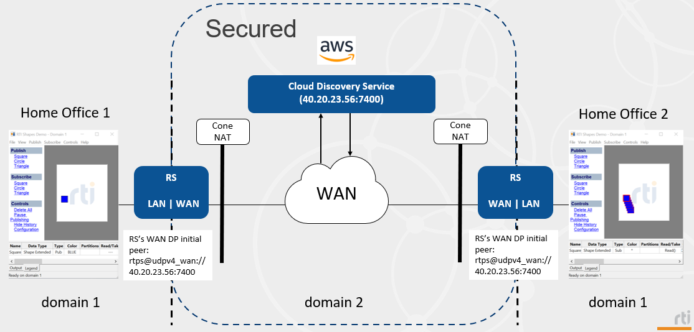

# Security scenario 2

## Requirements

Packages:

```plaintext
rti_connext_dds-7.3.0-pro-host-<architecture>.<run/exe>
rti_real_time_wan_transport-7.3.0-host-<architecture>.rtipkg
rti_cloud_discovery_service-7.3.0-host-<architecture>.rtipkg
rti_security_plugins-7.3.0-host-<architecture>.rtipkg
```

With regards to network configuration, you'll need to add a security rule on
your AWS instance to allow incoming / outgoing traffic on PUBLIC_PORT, for the
UDP protocol. For instance:


## Diagram



Cloud Discovery Service will put the Active Routing Services in contact when
they reach out to it. The Active Routing Services will point their their
initial peers at AWS. In the diagram above, AWS's address needs to be known by
the remote Active Routing Services. Only domain 2 (WAN) will be secured.

## How to run this scenario

On AWS:

1. In a terminal, set up NDDSHOME pointing at the Connext installation and set these variables:

    ```bash
    export PUBLIC_ADDRESS=<public_IP_address>
    export PUBLIC_PORT=<PUBLIC_PORT>
    ```

2. Run Cloud Discovery Service:

    ```bash
    cd security_scenarios/scenario_2/
    $NDDSHOME/bin/rticlouddiscoveryservice -cfgFile CdsConfig_Cloud.xml -cfgName CdsConfig_Cloud
    ```

On Home Office 1:

1. Start a Shapes Demo publisher on domain 1. Publish some shapes.
2. In a terminal, set up NDDSHOME pointing at the Connext installation and set these variables:

    ```bash
    export PUBLIC_ADDRESS=<public_IP_address>
    export PUBLIC_PORT=<PUBLIC_PORT>
    ```

3. Set the SECURITY_FILES_PATH environment variable pointing at the security files folder. This could be NDDSHOME or the *security_files* folder in this repository:

    ```bash
    export SECURITY_FILES_PATH=security_scenarios/security_files/
    ```

4. Run Routing Service:

    ```bash
    cd security_scenarios/scenario_2/
    $NDDSHOME/bin/rtiroutingservice -cfgFile RsConfig_Local.xml -cfgName RsConfig_Local
    ```

On Home Office 2:

1. Start a Shapes Demo subscriber on domain 1. Subscribe to some shapes.
2. In a terminal, set up NDDSHOME pointing at the Connext installation and set these variables:

    ```bash
    export PUBLIC_ADDRESS=<public_IP_address>
    export PUBLIC_PORT=<PUBLIC_PORT>
    ```

3. Set the SECURITY_FILES_PATH environment variable pointing at the security files folder. This could be NDDSHOME or the *security_files* folder in this repository:

    ```bash
    export SECURITY_FILES_PATH=security_scenarios/security_files/
    ```

4. Run Routing Service:

    ```bash
    cd security_scenarios/scenario_2/
    $NDDSHOME/bin/rtiroutingservice -cfgFile RsConfig_Local.xml -cfgName RsConfig_Local
    ```

## Expected output

After some seconds, once discovery is completed, Home Office 2 should start
receiving the shapes that Home Office 1 publishes. Actually, you could start
any number of Shapes Demo publishers on either side and the other one should
receive those, as well. Routing Service helps with scalability because you do
not need to initiate new WAN connections per application, you just need Routing
Service to take care of that for you.
