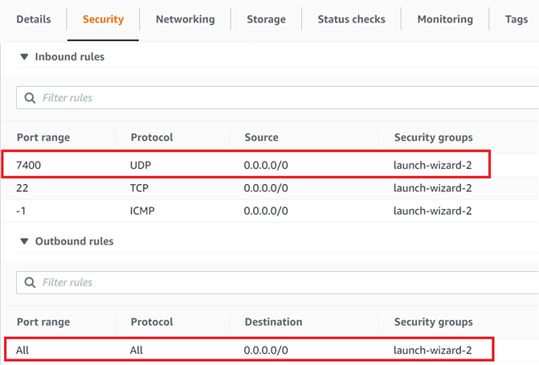

# Security scenario 2

## Requirements

Packages:
```
rti_connext_dds-6.1.0-pro-host-<architecture>.<run/exe>
rti_real_time_wan_transport-6.1.0-host-<architecture>.rtipkg
rti_security_plugins-6.1.0-host-<architecture>.rtipkg
```

Network configuration:
* Security rule on your AWS instance to allow incoming / outgoing traffic on PUBLIC_PORT, for the UDP protocol. For instance:



## Diagram


Cloud Discovery Service will put the active Routing Service in contact when they reach out to it. The active Routing Services will point their their initial peers at AWS. In the diagram above, AWS's address needs to be known by the remote active Routing Services. Only domain 2 (WAN) will be secured.

## How to run this scenario

1. On AWS:
    1. In a terminal, set up NDDSHOME pointing at the Connext installation and set these variables:
    ```
    export PUBLIC_ADDRESS=<public_IP_address>
    export PUBLIC_PORT=<PUBLIC_PORT>
    ```
    2. Run Cloud Discovery Service:
    ```
    cd security_scenarios/scenario_2/
    $NDDSHOME/bin/rticlouddiscoveryservice -cfgFile CdsConfig_Cloud.xml -cfgName CdsConfig_Cloud
    ```
2. On Home Office 1:
    1. Start a Shapes Demo publisher on domain 1. Publish some shapes.
    2. In a terminal, set up NDDSHOME pointing at the Connext installation and set these variables:
    ```
    export PUBLIC_ADDRESS=<public_IP_address>
    export PUBLIC_PORT=<PUBLIC_PORT>
    ```
    3. Set the SECURITY_FILES_PATH environment variable pointing at the security files folder. This could be NDDSHOME or the *security_files* folder in this repository:
    ```
    export SECURITY_FILES_PATH=security_scenarios/security_files/
    ```
    4. Run Routing Service:
    ```
    cd security_scenarios/scenario_2/
    $NDDSHOME/bin/rtiroutingservice -cfgFile RsConfig_Local.xml -cfgName RsConfig_Local
    ```
3. On Home Office 2:
    1. Start a Shapes Demo subscriber on domain 1. Subscribe to some shapes.
    2. In a terminal, set up NDDSHOME pointing at the Connext installation and set these variables:
    ```
    export PUBLIC_ADDRESS=<public_IP_address>
    export PUBLIC_PORT=<PUBLIC_PORT>
    ```
    3. Set the SECURITY_FILES_PATH environment variable pointing at the security files folder. This could be NDDSHOME or the *security_files* folder in this repository:
    ```
    export SECURITY_FILES_PATH=security_scenarios/security_files/
    ```
    4. Run Routing Service:
    ```
    cd security_scenarios/scenario_2/
    $NDDSHOME/bin/rtiroutingservice -cfgFile RsConfig_Local.xml -cfgName RsConfig_Local
    ```

# Expected output

After some seconds, once discovery is completed, Home Office 2 should start receiving the shapes that Home Office 1 publishes. Actually, you could start any number of Shapes Demo publishers on either side and the other one should receive those, as well. Routing Service helps scaling.